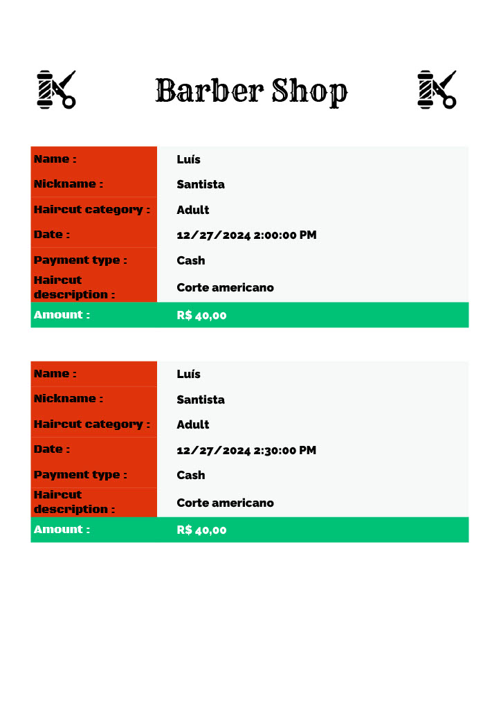

## 💈 Gerenciamento de agendamento de cabeleireiro ✂️

API desenvolvida em C# com o **.NET 8** utilizando o framework **ASP.NET Core** adotando os princípios do **Domain-Driven-Design (DDD)**, projetada para gerenciar agendamentos de cortes de cabelo de forma prática e eficaz. Esta aplicação permite que os usuários realizem agendamentos de cortes, especificando o tipo de corte desejado e armazenando os dados de forma segura em um banco de dados **MySQL**. 

Além disso, é possível cancelar agendamentos, consultar detalhes dos agendamentos realizados, verificar a disponibilidade de horários e atualizar as informações do agendamento, como a data ou o tipo de corte.
O projeto também oferece a funcionalidade de emissão de um arquivo PDF com todas as informações do agendamento, para melhor controle e acesso aos detalhes do serviço agendado.

A arquitetura da **API** se baseia-se em **REST**, utilizando métodos **HTTP** proporcionando uma comunicação simplificada e eficiente. O projeto é complementado por uma documentação **Swagger**, proporcionando uma interface gráfica interativa facilitando a exploração das funcionalidades.

Dentre os pacotes NuGet utilizados, o **AutoMapper** é responsável pelo mapeamento entre os objetos de domínio e requisição/resposta, diminuindo a repetição desnecessário do código. Também foi utilizado o **FluentValidation** para implementar as regras de validações de forma simples e objetiva.Por fim, o **EntityFramework** atuando como um ORM (Object-Relational-Mapper) simplificando e facilitando as interações com o banco de dados diretamente com objetos .NET, eliminando a necessidade de lidar com consultas SQL.

## 👨‍💻 Developed in 

![icon-dot-net]
![icon-mysql]
![icon-swagger]
![icon-visual-studio]
![icon-windows]


## 🔗 Endpoints

- **/HairScheduler**

    - **POST** /HairScheduler
    - **GET** /HairScheduler
    - **GET** /HairScheduler/{nickname}
    - **PUT** /HairScheduler/{nickname}
    - **DELETE** /HairScheduler/{nickname}

- **/GeneratorPDFInfo**

    - **GET** /GeneratorPDFInfo/{nickname}

## ▶️ Getting Started

Para obter uma cópia local deste projeto, siga estes passos simples.

### Requisitos

- Visual Studio Versão 2022+ ou Visual Studio Code
- Windows 10+ ou Linux/MacOS com [.NET SDK][dot-net-sdk] instalado 
- MySQL Server

### Instalação 

1. Clone o repositório: 
    ```sh
    git clone https://github.com/lhspinheiro/AspNetCoreWebAPI-HaircutScheluder.git
     ```
2. Preencha as informações no arquivo `appsettings.Development.json`.
3. Execute a API e faça o bom proveito.

## 📃 Documentation

Documentação Swagger de maneira interativa

![image-swagger]

## 📄 Generated PDF

É possível emitir um PDF de um determinado agendamento, contendo as informações completa do serviço solicitado.

<p align="center">
  
</p>


<!-- Links -->
[dot-net-sdk]: https://dotnet.microsoft.com/pt-br/download/dotnet/8.0

<!-- Images -->
[image-swagger]: /images/Project.jpg


<!-- Icons -->
[icon-dot-net]: https://img.shields.io/badge/.NET-512BD4?logo=dotnet&logoColor=fff&style=for-the-badge
[icon-mysql]: https://img.shields.io/badge/MySQL-4479A1?logo=mysql&logoColor=fff&style=for-the-badge
[icon-swagger]: https://img.shields.io/badge/Swagger-85EA2D?logo=swagger&logoColor=000&style=for-the-badge
[icon-visual-studio]: https://img.shields.io/badge/Visual%20Studio-5C2D91.svg?style=for-the-badge&logo=visual-studio&logoColor=white
[icon-windows]: https://img.shields.io/badge/Windows-0078D6?style=for-the-badge&logo=windows&logoColor=white
